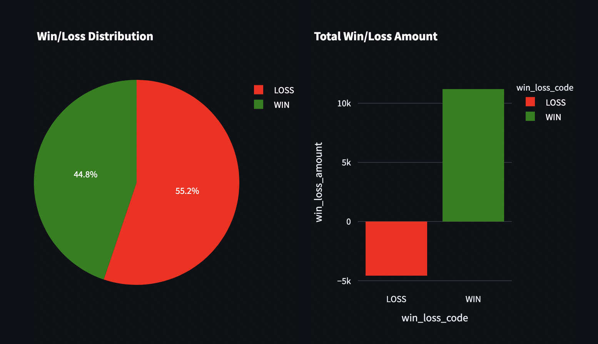
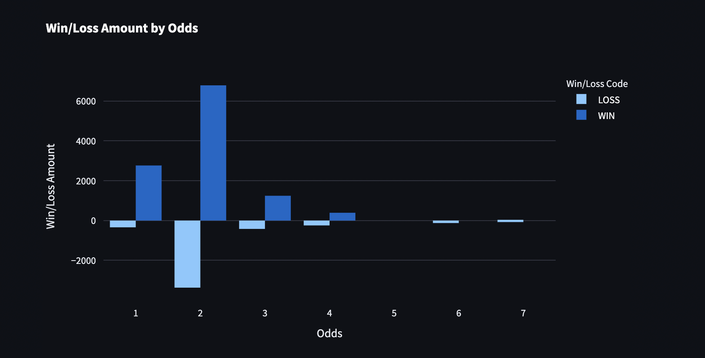
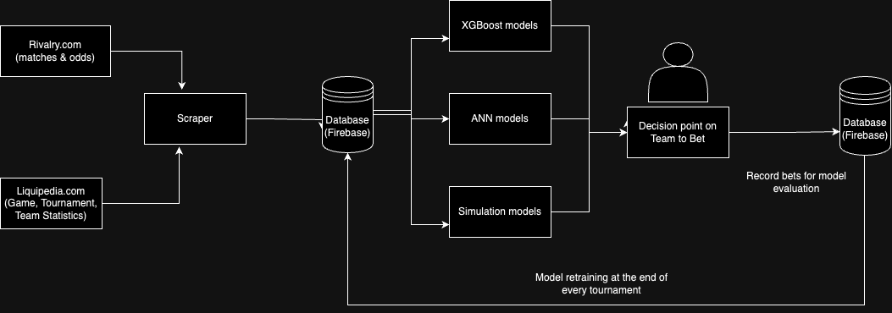

# Holy Grail of Sports Betting
- Authored by: Chester Garett Calingacion
- Page last updated on: Aug 4, 2024

## Introduction
In traditional financial markets, retail investors face significant challenges: 1) identifying optimal times to BUY, HOLD, and SELL, 2) competing against market whales, and 3) managing biases caused by human emotions. For sports betting, although human emotions still heavily influence decisions - the time variability is negligible and market whales are fewer. This system exploits these factors. To date, the devised system has generated a profit of 10.54% from 154 bets.

## Hypothesis
The system hypothesizes that betting against popular public bets—referred to as "fading the public" in betting terminology—will yield profitable outcomes.

## Assumptions & Constraints
1. Risk Management : An equal bet amount will be placed on each match until a desired profit level is achieved. Subsequently, bet amounts will be gradually increased for the next set of bets.
2. Focus on E-sports: E-sports are chosen due to:
    - The absence of physical attributes (e.g., height, strength), allowing focus on mental attributes.
    - The dynamic nature of the meta, with game developers frequently updating game aspects, leading to frequent shifts in current powerhouses and laggards.
3. Game-Specific Assessments: Each game will be evaluated differently, with various subsystems employing different approaches.

## Methodology
The general strategy is to fade the public. However, deviations from this general strategy are employed for different games:
-   Mobile Legends: Bang Bang (MLBB): Fade the public during group/elimination stages; use AI model predictions during playoffs.
-   Honor of Kings (HOK): Fade the public during group/elimination stages.
-   Valorant: Fade the public during group/elimination stages.
-   League of Legends (LOL): Fade the public during group/elimination stages.

## Results & Findings
Turns out, the public sometimes get it right. As such, being selective when we bet against the public and further filter down prospective bets will maximize profit results. After, post bet-analysis and match simulations current profit stands at <b>10.54%</b>. Breakdown per game are as follows:

-   mlbb with profit of <b>27.84%</b>
-   lol with profit of <b> 3.72% </b>
-   dota2 with loss of <b> -3.33% </b>
-   hok with loss of <b> -5.93% </b>
-   valorant with profit of <b> -28.24% </b>

The best bet performance is observed in MLBB, attributed to the author's in-depth knowledge of the game and the incorporation of qualitative factors and simulations into decision-making models. For other games, bets are placed primarily based on odds. To enhance yields without detailed game knowledge, an odds simulation model was developed, identifying bets with odds of <b>2 and 3 </b> as yielding the best results.

## Conclusion
The findings indicate consistent profitability in the system. This research underscores the importance of strategic betting against public sentiment and the value of game-specific knowledge and simulation models in maximizing betting profits.

For more details, visit the deployed app @ https://letsgamble.streamlit.app/

## Appendix

### App Architecture
